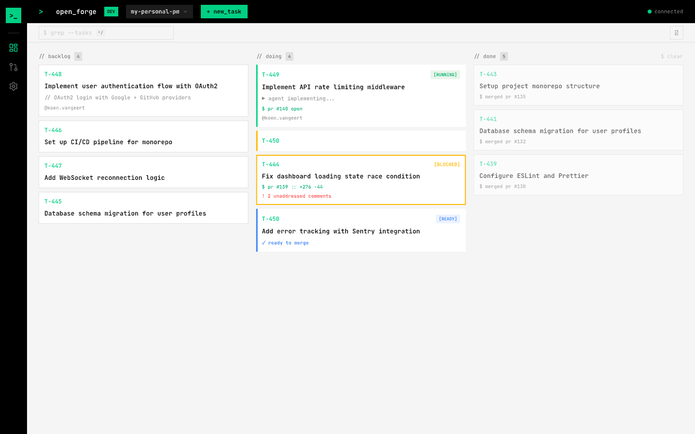
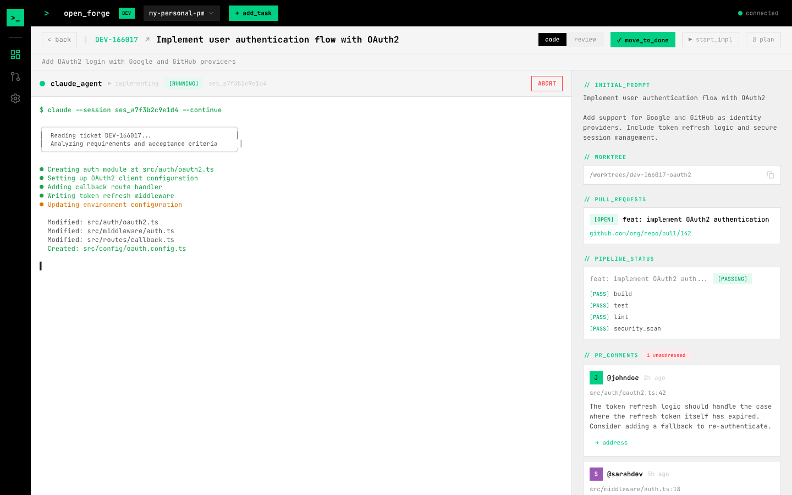
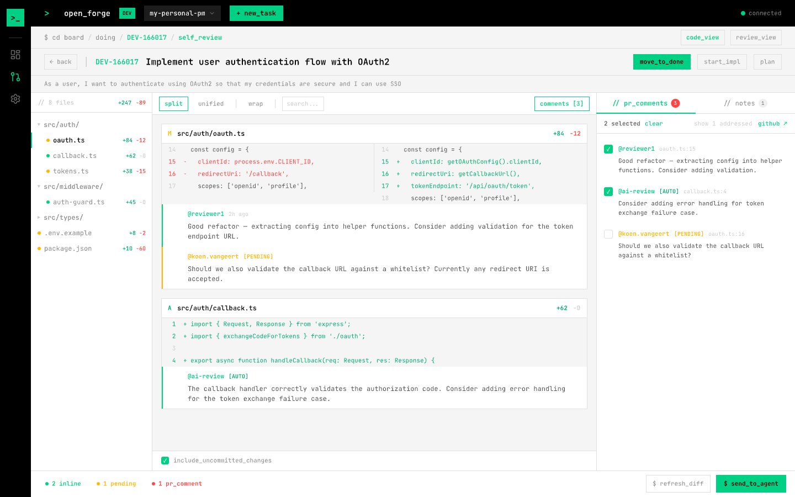

<p align="center">
  
</p>

<h1 align="center">Open Forge</h1>

<p align="center">
  A desktop app that orchestrates AI coding agents. Manage tasks on a kanban board, launch agents in isolated git worktrees, and review their work — all from one place.
</p>

---



## Quick install

Install the latest prebuilt release (macOS, no build tools required):

```bash
curl -fsSL https://raw.githubusercontent.com/koenvangeert/openforge/main/scripts/install.sh | sh
```

To install a specific version:

```bash
OPENFORGE_VERSION=0.0.5 curl -fsSL https://raw.githubusercontent.com/koenvangeert/openforge/main/scripts/install.sh | sh
```

> **Note:** The app is unsigned. The install script automatically removes the macOS quarantine flag. If you downloaded the DMG manually, run:
> ```
> xattr -rd com.apple.quarantine /Applications/Open\ Forge.app
> ```

## What it does

Open Forge is a command center for AI-assisted development. You define coding tasks, an AI agent (Claude Code or OpenCode) implements them in isolated git worktrees on dedicated branches, and the app tracks the full lifecycle: agent progress, CI status, PR reviews, and Jira sync.

| | |
|---|---|
| **Kanban board** | Organize tasks across Backlog, Doing, and Done columns. Search, create, and manage tasks with keyboard shortcuts. |
| **AI agents** | Launch Claude Code or OpenCode agents per task. Each runs in its own git worktree and branch with a live embedded terminal. |
| **Self-review** | Review agent changes with a syntax-highlighted diff viewer. Leave inline comments and send feedback back to the agent. |
| **PR review** | Review pull requests assigned to you. Browse diffs, leave comments, and submit reviews directly from the app. |
| **GitHub & Jira** | Background polling keeps PR status, CI checks, and Jira issues in sync. |
| **Voice input** | Dictate instructions to the agent using on-device speech recognition (Whisper). |





## Tech stack

- **Frontend** — Svelte 5, TypeScript, Tailwind CSS v4, daisyUI v5
- **Backend** — Rust, Tauri v2, SQLite
- **AI agents** — Claude Code CLI (via PTY), OpenCode (via HTTP/SSE)

## Prerequisites

- [Rust](https://rustup.rs/) (1.60+)
- [Node.js](https://nodejs.org/) (20+) and [pnpm](https://pnpm.io/) (10+)
- macOS with Xcode Command Line Tools (for Metal/Whisper support)
- [Claude Code](https://docs.anthropic.com/en/docs/claude-code) or [OpenCode](https://github.com/opencode-ai/opencode) installed

## Local development

```bash
# Install frontend dependencies
pnpm install

# Run the full desktop app in dev mode
pnpm tauri:dev

# Or run just the frontend dev server (no Tauri shell)
pnpm dev
```

## Testing

```bash
# Frontend tests
pnpm test

# Rust tests (from src-tauri/)
cd src-tauri && cargo test
```

## Building

```bash
# Production build
pnpm tauri:build

# Install the built macOS app
pnpm tauri:install
```

## First-run setup

1. Launch the app — the project setup dialog appears automatically
2. Go to **Settings > Global** to configure your AI provider and GitHub token
3. Go to **Settings > Project** to set the GitHub repo and optional Jira board
4. Create a task (`Cmd+T`), right-click it, and choose **Start Implementation**
