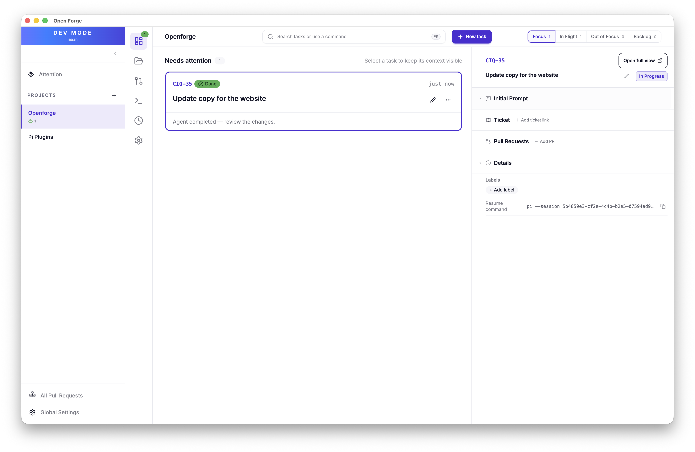

<h1 align="center">Open Forge</h1>

<p align="center">
  A calm desktop command center for AI-assisted development. Turn a task into an isolated agent run, watch the terminal, review the diff, and decide what ships — without losing the thread.
</p>

<p align="center">
  <a href="#quick-install">Install</a> ·
  <a href="#why-open-forge-exists">Why it exists</a> ·
  <a href="#what-it-does-today">Features</a> ·
  <a href="#first-run-setup">First run</a> ·
  <a href="CONTRIBUTING.md">Contributing</a>
</p>

---


## Why Open Forge exists

AI coding agents are good at producing code, but their surrounding workflow still creates admin: writing tasks, choosing a project, starting an agent, watching for attention, checking CI, reading diffs, giving feedback, and deciding what actually ships.

Open Forge puts that loop in one focused, local-first place. It automates repeated coordination while keeping problem framing, review, trade-offs, and the shipping decision visible and firmly owned by the developer.

## What it does today

Open Forge is a macOS desktop app for running AI coding agents across one or more projects while keeping attention on the next actionable item.

| Area | What Open Forge provides |
|---|---|
| **Flow board** | Create, prioritize, search, and move tasks from a focused board with an always-visible detail pane and keyboard navigation. |
| **Agent runs** | Start Claude Code, OpenCode, Pi, Codex, or Grok-based agents per task. Each run gets an isolated git worktree and branch. |
| **Live terminals** | Watch embedded PTY output, use multiple shell tabs, and keep agent lifecycle state attached to the task. |
| **Self-review** | Inspect agent changes, leave inline feedback, and send that feedback back into the loop. |
| **PR review** | Review assigned GitHub pull requests, browse diffs and comments, submit reviews, and track CI/review status. |
| **Project attention** | Track blocked agents, review readiness, CI changes, and tasks that need a decision without constant noise. |
| **Plugins and skills** | Extend the desktop surface with managed plugins and reusable agent skills. |
| **Voice input** | Dictate instructions with on-device Whisper transcription. |
| **OpenForge CLI** | Let agents and scripts read and update tasks through the local Open Forge bridge. |

## Quick install

Install the latest prebuilt macOS release:

```bash
curl -fsSL https://raw.githubusercontent.com/koenvangeert/openforge/main/scripts/install.sh | sh
```

To install a specific version:

```bash
curl -fsSL https://raw.githubusercontent.com/koenvangeert/openforge/main/scripts/install.sh | OPENFORGE_VERSION=0.0.5 sh
```

> **Note:** The app is unsigned. The install script removes the macOS quarantine flag automatically. If you downloaded the DMG manually, run:
```bash
xattr -rd com.apple.quarantine /Applications/Open\ Forge.app
```

## First-run setup

1. Launch the app — the project setup dialog appears automatically.
2. Go to **Settings > Global** to configure your AI provider and GitHub token.
3. Go to **Settings > Project** to set the GitHub repository.
4. Create a task (`Cmd+T`), right-click it, and choose **Start Task**.

## Contributing

Development setup, testing, source builds, architecture notes, and CLI maintenance workflows are documented in [`CONTRIBUTING.md`](CONTRIBUTING.md). Terminal protocol support, image limits, and fallback behavior are documented in [`docs/terminal-inline-images.md`](docs/terminal-inline-images.md).

## License

Open Forge is source-available proprietary software. You may inspect, build, and modify the app for personal or internal use, but you may not commercially resell, redistribute, or offer it as a competing hosted or packaged product without permission. See [`LICENSE`](LICENSE).

The public `@openforge-app/plugin-sdk` and `@openforge-app/terminal-runtime` packages are licensed separately under MIT. See their package licenses for details.
