# TerminalX full-app performance findings

Task: KVG-4423

## Decision

The first product bottleneck to address is the Rust terminal-model worker on sustained plain-text output. The renderer is not CPU-bound in this workload. A live presentation path that does not wait for Ghostty's authoritative model parse has the largest likely payoff, but it crosses the most ownership boundaries and needs strict sequencing and recovery tests.

The 149 ms echo and 117 ms recovery numbers overstate product latency. Both include repeated Playwright actions and presentation-proof waits. Shell readiness also mixes navigation, Playwright retry behavior, shell startup, and the first painted marker. The harness needs phase timestamps before these values can guide smaller product changes.

Do not treat the memory result as an Electron main-process measurement. The report's `native.app` value is the `pnpm exec electron` launcher process. A sampled real Electron main process was about 193 to 212 MiB. The full Electron subtree was about 862 MiB at the end of one profiled run, while the harness reported about 1.02 GiB from the launcher root.

No performance improvement was implemented in this task.

## Reproducible setup

The measured revision was `d0a3f766935711748ef13986e184484a6eb0a69f`.

| Property | Value |
| --- | --- |
| Host | Apple M5, 10 logical cores, 32 GiB RAM |
| OS | Darwin 25.6.0, arm64 |
| Node | 24.14.0 |
| Electron | 43.4.1 |
| Chromium | 150.0.7871.224 |
| Renderer | xterm WebGL |
| Device pixel ratio | 2 |
| Terminal geometry | 109 columns by 27 rows |
| Fixture | Generated disposable repository and isolated app data |

The run set used one warm-up followed by five equivalent cached-build runs:

```bash
pnpm performance:terminal:full-app -- \
  --output=artifacts/desktop-test/terminal-performance/KVG-4423/20260830T203219Z/warmup

for run in 01 02 03 04 05; do
  pnpm performance:terminal:full-app -- \
    --output="artifacts/desktop-test/terminal-performance/KVG-4423/20260830T203219Z/run-$run"
done
```

The complete local artifact set is under:

```text
artifacts/desktop-test/terminal-performance/KVG-4423/20260830T203219Z
```

`README.md` in that directory describes every profile. `artifact-manifest.sha256` checks all raw reports, screenshots, child logs, driver timings, process samples, the renderer CPU profile, and the sidecar stack sample. `aggregate.json` contains the derived baseline statistics.

The preserved profile runner reproduces the extra attribution runs:

```bash
root=artifacts/desktop-test/terminal-performance/KVG-4423/20260830T203219Z

node "$root/profile-runner.mjs" "$root/profile-observe-reproduction"
SPLIT_DRIVER=1 node "$root/profile-runner.mjs" "$root/profile-driver-split-reproduction"
CPU_PROFILE=1 node "$root/profile-runner.mjs" "$root/profile-cpu-reproduction"
SIDECAR_SAMPLE=1 node "$root/profile-runner.mjs" "$root/profile-sidecar-reproduction"
PTY_OUTPUT_BYTES=1048576 node "$root/profile-runner.mjs" "$root/scaling-1m-reproduction"
```

## Baseline results

All six baseline runs passed their correctness checks. The table below excludes the first warm-up run and summarizes five equivalent runs.

| Measurement | Median across runs | Run range | Coefficient of variation |
| --- | ---: | ---: | ---: |
| Full command wall time | 10.457 s | 10.382 to 10.705 s | 1.17% |
| Shell readiness | 2,699.9 ms | 2,681.3 to 2,727.1 ms | 0.73% |
| Driver-to-painted echo median | 149.2 ms | 141.0 to 149.4 ms | 2.50% |
| Driver-to-painted echo p95 | 150.1 ms | 149.2 to 150.4 ms | 0.35% |
| Bulk input, 2,114 bytes | 0.009 MiB/s | 0.009 to 0.009 MiB/s | 0.25% |
| Bulk input duration | 216.2 ms | See raw reports | n/a |
| Painted PTY output, 256 KiB | 0.208 MiB/s | 0.205 to 0.214 MiB/s | 2.13% |
| Painted PTY output duration | 1,199.4 ms | See raw reports | n/a |
| View recovery | 116.8 ms | 115.6 to 117.7 ms | 0.67% |

The current run set is faster than the approximate reference for shell readiness and painted throughput. Echo, recovery, and process-tree RSS are close to the reference.

| Measurement | Approximate reference | This run set | Difference |
| --- | ---: | ---: | ---: |
| Shell readiness | 4.19 s | 2.70 s | 1.49 s lower |
| Echo median and p95 | 149 ms | 149.2 and 150.1 ms | effectively unchanged |
| Painted PTY throughput | 0.173 MiB/s | 0.208 MiB/s | about 20% higher |
| Recovery | 117 ms | 116.8 ms | unchanged |
| Process-tree RSS | 1.0 GiB | 1.021 GiB | close |

This is not a new universal baseline. It is one machine, one revision, one geometry, and one cached-build state.

## Warm-up, build, launch, and scenario cost

The first run took 36.79 seconds. The five cached runs had a 10.46 second median. Cold cache and build work therefore added about 26.3 seconds.

The cold child log reported a 16.77 second Rust build and 758 ms Vite readiness. A cached run reported a 150 ms Rust build and 157 ms Vite readiness. The remaining cold difference came from dependency, plugin, Electron build, launch, and filesystem cache work. The original child log has no timestamps, so it cannot split that remainder reliably.

A separate cached profile added monotonic phase marks. Its total was 10.62 seconds, 1.5% above the unprofiled median.

| Cached phase | Duration |
| --- | ---: |
| Fixture and plugin artifact checks | about 81 ms |
| Ghostty dependency preparation and Vite readiness | about 798 ms |
| Cached Rust sidecar build | 128 ms |
| Electron main and preload build | 3,124 ms |
| Electron launch to Playwright page | 554 ms |
| Total before the terminal scenario | 4,684 ms |
| Terminal scenario and final screenshot work | 5,586 ms |
| Shutdown | 73 ms |

The 3.12 second Electron build dominates cached pre-scenario cost. It is harness launch cost, not steady-state TerminalX behavior.

## Path attribution

The diagram separates the product path from the harness-only observation path. Solid arrows carry product commands or terminal bytes. Dotted arrows exist only to drive and verify the performance scenario.

```mermaid
flowchart LR
  subgraph Harness["Performance harness"]
    Driver["Playwright driver<br/>actions and timers"]
    Probe["Terminal test probe<br/>correctness and paint evidence"]
  end

  subgraph Renderer["Electron renderer"]
    Surface["Svelte terminal surface<br/>mount, visibility, focus"]
    Runtime["Terminal runtime and state view<br/>lifecycle, instance, sequence, recovery"]
    Transport["Desktop terminal transport<br/>invoke, subscribe, base64 decode"]
    View["TerminalView adapter<br/>xterm input and output"]
    Xterm["xterm parser and buffer"]
    WebGL["xterm WebGL renderer"]
  end

  subgraph Electron["Electron boundary"]
    Preload["Preload bridge<br/>isolated renderer API"]
    Main["Electron main IPC and sidecar client"]
    Forwarder["App-event forwarder<br/>events and reconnect controls"]
  end

  subgraph Sidecar["Rust sidecar"]
    Command["Command boundary<br/>spawn, write, resize, snapshot"]
    Writer["Ordered PTY writer"]
    Pty["PTY master"]
    Shell["Shell and child processes"]
    Reader["PTY reader<br/>8 KiB reads"]
    Model["Ghostty model worker<br/>authoritative parse and snapshots"]
    Batcher["Model event bridge<br/>sequence, 16 ms or 64 KiB batch"]
    Publisher["Runtime event publisher"]
  end

  subgraph Graphics["Browser graphics"]
    Compositor["Chromium compositor<br/>presented frame"]
  end

  Surface -->|"owns visible view"| View
  Driver -. "fill and Enter" .-> Xterm
  Xterm -->|"onData bytes"| View
  View -->|"user input"| Runtime
  Runtime -->|"write PTY command"| Transport
  Transport --> Preload
  Preload --> Main
  Main --> Command
  Command --> Writer
  Writer --> Pty
  Pty --> Shell

  Shell -->|"PTY output"| Pty
  Pty --> Reader
  Reader -->|"feed bytes"| Model
  Model -->|"sequenced output frame"| Batcher
  Batcher --> Publisher
  Publisher --> Forwarder
  Forwarder --> Preload
  Preload -->|"desktop event"| Transport
  Transport -->|"decoded bytes"| Runtime
  Runtime -->|"current instance and contiguous sequence"| View
  View --> Xterm
  Xterm --> WebGL
  WebGL --> Compositor

  Runtime -. "state observation" .-> Probe
  View -. "generation and capture" .-> Probe
  Compositor -. "proof frames" .-> Probe
  Probe -. "drain result" .-> Driver
```



### How data moves

1. **Input.** Xterm receives keyboard or paste input. `TerminalView` forwards the byte string to the terminal runtime. The desktop transport crosses preload and Electron main, then the Rust command boundary writes through `OrderedPtyWriter` to the PTY master and shell.
2. **Output.** The PTY reader reads up to 8 KiB at a time and feeds those bytes to the Ghostty model worker. Ghostty updates authoritative terminal state before the model event bridge publishes a sequenced byte range. Electron forwards that event to the renderer. The terminal runtime rejects stale PTY instances and noncontiguous sequences before writing the decoded bytes into xterm.
3. **Presentation.** Xterm parses the bytes into its buffer and WebGL renderer. Chromium composites the frame. Normal product code stops here.
4. **Measurement.** The test probe watches received bytes, model sequence, write generation, parsed generation, visible marker text, and render frames. The Playwright timer stops only after all checks agree. This last loop is harness code, so its tab clicks, CDP calls, polling, and proof frames must not be mistaken for product work.

### Responsibilities by part

| Part | Responsibility | Important data or invariant | Main ownership |
| --- | --- | --- | --- |
| Playwright driver | Opens the task terminal, submits commands, switches views, and owns end-to-end timers. | Command marker and driver start time | `scripts/desktop-test/driver.mjs` |
| Terminal test probe | Observes pool entries and waits for bytes, sequence continuity, model progress, marker visibility, and a covering render generation. | Correctness evidence, not product state | `src/lib/terminalTestProbe.ts` |
| Svelte terminal surface | Mounts the view, reports visibility, and manages the focusable terminal region. | One visible attachment for the logical terminal | `packages/terminal-runtime/src/TaskTerminalSurface.svelte` |
| TerminalView adapter | Wraps xterm, translates xterm input into runtime callbacks, accepts live output, and records write, parse, and render generations. | `writeGeneration`, `parsedGeneration`, `renderFrame` | `packages/terminal-runtime/src/xtermTerminalView.ts`, `xtermPresentation.ts` |
| Xterm and WebGL | Parses VT bytes into the browser-side buffer and draws cells, glyphs, cursor, and selection. | Presented browser buffer and renderer frame | `@xterm/xterm`, `@xterm/addon-webgl` |
| Terminal runtime and state view | Owns terminal entries, attachment lifecycle, visibility recovery, current PTY instance, and model sequence. It is the renderer's ordering gate. | Reject stale `instance_id`; accept only contiguous sequence ranges | `packages/terminal-runtime/src/terminalRuntime.ts`, `terminalStateView.ts` |
| Desktop terminal transport | Maps runtime operations to the desktop bridge, subscribes to model and lifecycle events, and decodes base64 output into bytes. | Typed runtime events and decoded byte arrays | `src/lib/desktopTerminalTransport.ts` |
| Preload bridge | Exposes the approved desktop API without giving the renderer direct Node or sidecar access. | Renderer isolation and allowed IPC calls | Electron preload modules and `src/lib/ipc.ts` wrappers |
| Electron main IPC and sidecar client | Owns the sidecar process connection and routes renderer commands to the Rust command boundary. | Sidecar availability, request and response routing | `src/electron/sidecar.ts` and Electron IPC modules |
| App-event forwarder | Carries sidecar events to renderer listeners and emits reconnect or gap controls when the stream is interrupted. | Event order and reconnect state | `src/electron/eventForwarder.ts` |
| Rust command boundary | Validates spawn, write, resize, and snapshot requests and returns `Result<T, String>` across the desktop boundary. | Camel-case frontend command contract and current session identity | Rust app invoke and PTY manager commands |
| Ordered PTY writer | Serializes user input and Ghostty protocol replies into one PTY input stream. | No interleaved writes | `src-tauri/src/pty_manager/ordered_writer.rs` |
| PTY master and shell | Runs the real shell and child processes and supplies terminal input and output bytes. | Operating-system PTY semantics | `src-tauri/src/pty_manager/session` |
| PTY reader | Reads 8 KiB chunks, feeds the model, updates passive output state, and publishes to attachment paths. | Bounded queues and no dropped bytes | `src-tauri/src/pty_manager/events.rs` |
| Ghostty model worker | Parses every PTY byte into authoritative terminal state, maintains recovery snapshots, and emits ordered output frames after parsing. | Authoritative model and monotonically increasing frame sequence | `src-tauri/src/terminal_model/worker_session.rs` |
| Terminal-model event bridge | Combines contiguous model frames up to 64 KiB or 16 ms, base64-encodes bytes, and publishes sequence ranges. | `start_sequence`, `sequence`, `instance_id` | `src-tauri/src/pty_manager/terminal_model_bridge.rs` |
| Chromium compositor | Presents the WebGL result. It is outside JavaScript heap accounting. | User-visible frame | Chromium and Electron |

### Where the measured bottleneck sits

The sustained-output bottleneck is the `PTY reader -> Ghostty model worker` step. The sidecar model worker reached one full core while xterm and the renderer remained mostly idle. The event bridge, Electron forwarding, renderer decode, and WebGL path were downstream waiters in this fixture.

The latency measurements also contain harness-only work. Repeated Playwright tab clicks occur before each echo, and the probe waits for compositor-proof frames after xterm renders. Those steps are visible as dotted arrows and explain why the end-to-end number is larger than normal focused typing latency.

### Shell readiness

One split-driver run measured 2,765.0 ms from scenario start to the painted shell-ready marker.

| Part | Duration |
| --- | ---: |
| Bridge check and open seeded terminal | about 914 ms |
| Click Shell 1 tab | 45.8 ms |
| Wait for focus | 0.9 ms |
| Playwright `fill()` for the first command | 1,742.9 ms |
| Press Enter | 6.2 ms |
| Drain to presented marker | 48.4 ms |

The 1.74 second `fill()` is the largest component. Later fills took about 2.2 ms. Playwright appears to retry or wait while the newly created terminal becomes input-ready. This is useful user-facing evidence that the terminal is not ready, but it does not identify shell spawn, PTY attach, xterm mount, or input-enable time.

The current shell-ready metric should be renamed or split. It is not a direct shell spawn timer.

### Driver-to-painted echo

A no-op Playwright `page.evaluate()` round trip had a 0.395 ms median and 2.609 ms p95. Playwright transport alone does not explain 149 ms.

The repeated echo input action broke down as follows:

| Driver action | Median |
| --- | ---: |
| Click Shell 1 tab | 35.5 ms |
| Wait for terminal focus | 0.8 ms |
| Fill command | 2.2 ms |
| Press Enter | 2.6 ms |
| Total input action | about 41 ms |
| Output and presentation drain | about 92 to 109 ms |

About 35 ms is a tab click the harness repeats before every sample, even though a user typing into an already focused terminal does not repeat that action. The product output path and presentation proof account for most of the remainder.

Two configured waits contribute to the remainder:

- The Rust terminal-model bridge holds a batch for up to 16 ms.
- `xtermPresentation.ts` waits for two animation frames after xterm's render callback before resolving a presentation drain. At 60 Hz this can add about 33 ms.

The two frames prove presentation for the test. They do not slow ordinary terminal input because product code does not await the drain. Removing them would improve the benchmark number without proving that the user saw output.

### Bulk input

The 2,114 byte bulk command took a 216.2 ms median. In the split run, command submission took about 42 ms. The remaining time covered shell echo, model processing, transport, xterm parsing, and presentation proof. At this payload size the reported 0.009 MiB/s is mostly fixed latency, not a sustained input bandwidth limit.

### PTY output to presented frame

For 256 KiB, command submission took about 41 ms and the drain took about 1.14 seconds. The output path, not Playwright, dominates this metric.

A size sweep showed a linear cost after a roughly 108 ms fixed component:

| Payload | Result |
| --- | ---: |
| 64 KiB | 431.8 ms, 0.145 MiB/s |
| 256 KiB | 1,199.4 ms median, 0.208 MiB/s |
| 512 KiB | 2,249.7 ms median of two successful reruns, 0.222 MiB/s |
| 1 MiB | 4,565.1 ms, 0.219 MiB/s |

A linear fit has a 107.5 ms intercept, an asymptotic rate of 0.226 MiB/s, and R-squared of 0.999. This is a real sustained throughput ceiling for the fixture's long run of printable characters.

Process sampling during the 256 KiB workload found:

| Process | Average sampled CPU | Maximum sampled CPU |
| --- | ---: | ---: |
| Rust sidecar | 77.9% | 99.0% |
| Renderer | 13.2% | 17.2% |
| Electron main | 2.6% | 4.2% |
| GPU process | 4.9% | 5.6% |

The renderer CPU profile covered 5.082 seconds of the complete scenario. The renderer spent 4.538 seconds idle. Xterm functions accounted for about 129 ms of sampled self time, and OpenForge terminal functions accounted for about 11 ms. CDP performance counters recorded 583 ms of total renderer task time, including 179 ms of script, 24 ms of layout, and 51 ms of style recalculation.

A one-second Rust sidecar sample caught the terminal-model worker in 309 of 311 relevant samples. All 309 were in `GhosttyTerminalModel::feed`, 306 were in `ghostty_terminal_vt_write`, and 306 were in Ghostty's `printSliceFill`. The terminal-model bridge thread mostly waited for events. JSON serialization, base64, renderer decode, xterm, layout, and paint were not the throughput limit in this workload.

macOS sampling reduced painted throughput from about 0.206 to 0.134 MiB/s. The sample is valid for call-stack proportions only.

One of three 512 KiB runs failed because the renderer observed an incomplete terminal-model output sequence. The adjacent reruns and the 1 MiB run passed. This is an intermittent correctness issue, not a throughput sample.

### View recovery

The 117 ms recovery metric broke down into about 39 ms to click Browser, 32 ms to click Terminal, and 45 ms to drain presentation. Most of the result is navigation action and presentation proof. There is no evidence here for a slow recovery algorithm.

## Memory attribution

Five cached runs produced these medians:

| Measurement | After shell ready | After workload | Change |
| --- | ---: | ---: | ---: |
| Reported `native.app` RSS | 138.0 MiB | 138.0 MiB | 0.0 MiB |
| Renderer RSS | 315.5 MiB | 326.0 MiB | +10.5 MiB |
| GPU RSS | 114.5 MiB | 115.5 MiB | +1.0 MiB |
| Electron launcher-root tree RSS | 1,011.0 MiB | 1,021.0 MiB | +9.9 MiB |
| JavaScript heap used | 73.1 MiB | 64.2 MiB | -8.9 MiB |

The short workload does not show a JavaScript heap leak. Native renderer RSS grew by about 10.5 MiB, which can include xterm buffers, WebGL resources, native backing stores, and allocator retention.

The `native.app` label is wrong for this launcher. `runFullAppTerminalPerformance()` passes the PID returned by spawning `pnpm exec electron`. That PID is a launcher wrapper, not Electron's browser process.

A final process snapshot from the actual Electron main process contained:

| Process | RSS |
| --- | ---: |
| Renderer | 321.3 MiB |
| Electron main | 211.9 MiB |
| GPU | 130.8 MiB |
| Plugin host | 69.1 MiB |
| Rust sidecar | 63.0 MiB |
| Electron utility | 58.6 MiB |
| Shell | 7.1 MiB |
| Actual Electron subtree total | 861.8 MiB |

The profiled harness command used about 2.1 GiB across all descendants during the scenario because it also kept Vite, build wrappers, Playwright, and the profiler alive. That number is harness footprint. It is not product process-tree RSS.

## Ranked proposals

### 1. Decouple live presentation from authoritative Ghostty parsing

The renderer currently receives live terminal-model output only after the sidecar's Ghostty model has processed each PTY read. For a 256 KiB run of printable characters, Ghostty's fill loop consumed nearly one core and set the 0.226 MiB/s sustained ceiling.

A candidate design should deliver ordered raw PTY output to the visible xterm immediately while the authoritative Ghostty model catches up in parallel. The model watermark remains the source of truth for recovery. Attachment, stale-instance filtering, reconnect, and snapshot replacement must reconcile the two streams without duplicates or gaps.

| Property | Assessment |
| --- | --- |
| Expected impact | Highest. Use 1 MiB/s as the first acceptance target, about 4.4 times the measured asymptotic rate. Confirm with real logs and TUI output before setting a product budget. |
| Complexity | High |
| Risk | High. Ordering, reconnect, view recovery, model fallback, and memory bounds can regress. |
| Ownership | Rust PTY reader and terminal model, event transport, terminal runtime sequencing, TerminalView recovery |
| Verification | Full-app 64 KiB to 1 MiB sweep, long-line and newline-heavy corpora, stale instance tests, reconnect gaps, hidden and visible views, snapshot recovery, terminal conformance, bounded queue tests, CPU and RSS comparison |

A lower-risk prototype can first coalesce larger reads before `GhosttyTerminalModel::feed`. The sidecar sample points to per-character Ghostty work, so batching alone may not reach the target.

### 2. Add explicit performance phase marks and an already-focused echo mode

Record monotonic timestamps for lifecycle start, shell spawn request, PTY creation, terminal attachment, xterm mount, input acceptance, first output, model publication, xterm parse, render callback, and presentation proof. Keep the existing end-to-end number, but report each segment.

For steady-state echo samples, focus once before warm-up. Do not click the Shell 1 tab before every measured sample. Retain a separate full-driver measurement for automation coverage.

| Property | Assessment |
| --- | --- |
| Expected impact | No product speedup. Removes about 35 ms of repeated driver action from the focused echo metric and turns the 2.7 second shell number into actionable phases. |
| Complexity | Low to medium |
| Risk | Low. Poor instrumentation could change scheduling, so marks must be passive. |
| Ownership | Desktop performance scripts, test probe, terminal lifecycle, terminal runtime |
| Verification | Unit tests for phase ordering and missing values, full-app report schema tests, equivalence between focused and full-driver correctness checks, profiler-off overhead below 2% |

This should land before a shell startup optimization.

### 3. Use adaptive terminal-model event flushing for small output

The bridge's fixed 16 ms hold trades latency for event batching. Publish the first small event immediately, then coalesce subsequent output while a burst is active. Keep the 64 KiB batch bound and existing sequence range.

| Property | Assessment |
| --- | --- |
| Expected impact | About 10 to 16 ms lower small-output echo latency. It may also reduce the fixed component of bulk input. It will not fix the 0.226 MiB/s Ghostty ceiling. |
| Complexity | Medium |
| Risk | Medium. A naive immediate flush can create an event storm and increase main or renderer CPU. |
| Ownership | Rust terminal-model bridge, app-event forwarding, desktop terminal transport |
| Verification | Fake-clock bridge tests, bounded event-count burst test, sequence continuity, small-output latency profile, 1 MiB throughput non-regression, CPU and RSS comparison |

### 4. Consider speculative shell creation after phase instrumentation

If phase marks show that shell spawn and PTY attachment dominate the 1.74 second first-fill wait, create Shell 1 when the task workbench becomes active instead of waiting for the Terminal tab.

| Property | Assessment |
| --- | --- |
| Expected impact | Possibly 0.5 to 1.7 seconds lower perceived first-terminal readiness. The current measurement cannot narrow that range. |
| Complexity | Medium |
| Risk | Medium to high. Hidden PTYs consume memory and processes and complicate task switching and teardown. |
| Ownership | Task workbench, `terminalPool.ts`, Rust PTY lifecycle |
| Verification | No orphan PTYs, exact teardown on task identity changes, no hidden output loss, tab switching, process-count and RSS limits, full-app readiness comparison |

Do not start this change until proposal 2 identifies the actual wait.

### 5. Add production-mode memory characterization before reducing terminal RSS

The current full-app harness runs Vite and a development Electron build. Add a packaged or production-renderer mode and identify the actual Electron main PID. Compare process roles, heap, native renderer RSS, GPU RSS, sidecar RSS, and plugin host RSS after repeated terminal create, flood, recover, and destroy cycles.

| Property | Assessment |
| --- | --- |
| Expected impact | Better decisions, not an immediate product reduction. It will remove launcher and development-process noise from the reported baseline. |
| Complexity | Medium |
| Risk | Low to medium. The production harness must retain the same fixture and presentation checks. |
| Ownership | Electron launcher, memory sampler, desktop test lifecycle, report schema |
| Verification | Realistic process hierarchy tests, packaged and dev equivalence checks, repeated lifecycle memory convergence, unavailable values never reported as zero |

The renderer is the largest single product process, but this run does not identify a leak or one allocation worth removing. Heap snapshots and repeated destroy cycles should come before a memory refactor.

## Work not recommended from this data

- Do not optimize xterm rendering first. The renderer was mostly idle during the throughput workload.
- Do not remove the two-frame presentation proof merely to improve the benchmark. That changes what the metric proves.
- Do not optimize view recovery from the 117 ms result. The measured time is mostly Playwright navigation and presentation proof.
- Do not tune the terminal-model event batch size as a throughput fix. The Ghostty feed worker, not the bridge or renderer, saturated first.

## Follow-up tasks created for discovered defects

- `KVG-4428`: correct Electron main RSS attribution in the full-app harness.
- `KVG-4429`: reproduce and fix the intermittent terminal-model output sequence gap found in one 512 KiB run.

These are correctness and measurement defects found during profiling. No implementation tasks were created for the ranked performance proposals because they have not been accepted yet.

## Validation and limits

Validation performed:

- One warm-up full-app run.
- Five equivalent cached-build full-app runs.
- One unprofiled phase run.
- One split-driver run.
- One renderer CPU profile run at a 1 ms sampling interval.
- One sidecar stack sample run.
- Four successful output-size points, plus two successful 512 KiB reruns after one retained sequence-gap failure.
- Raw harness correctness checks for expected bytes, contiguous sequences, markers, model watermark, and presented generation.

Known limits:

- The machine was not rebooted or placed in a dedicated benchmark account.
- CPU sampling used `ps`, whose `%CPU` value is process-lifetime weighted rather than a precise interval counter.
- The sidecar stack sampler perturbed throughput by about 35%.
- The fixture output is one long run of `x` characters. Newline-heavy logs and full-screen TUI updates need separate corpora.
- The development app includes Vite and build tooling that a packaged app does not.
- Five baseline runs characterize this machine and revision. They are not enough for a cross-machine performance budget.
