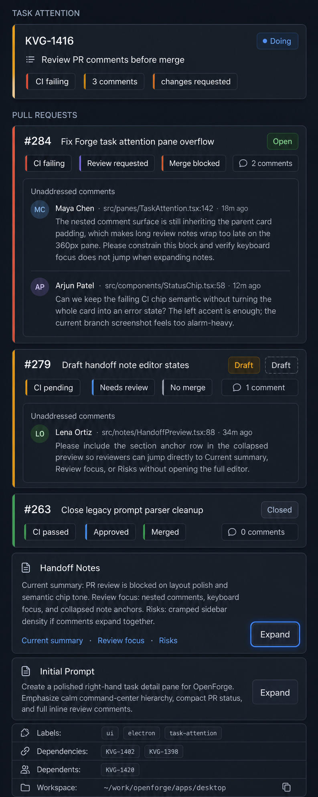
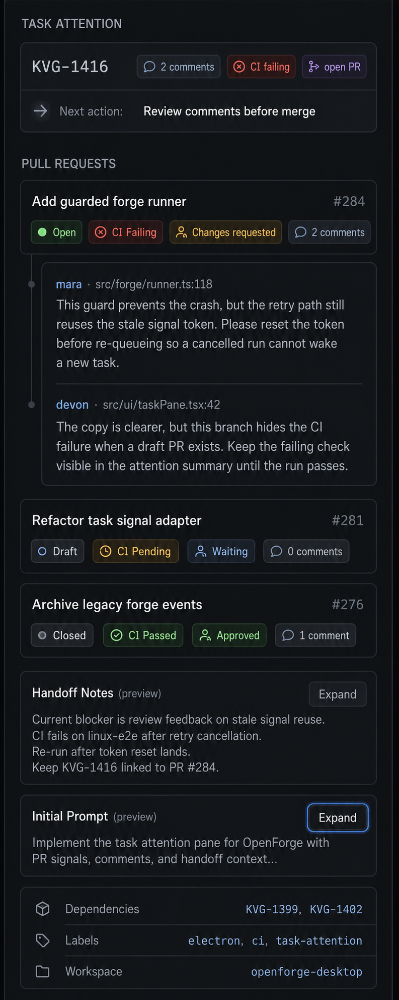
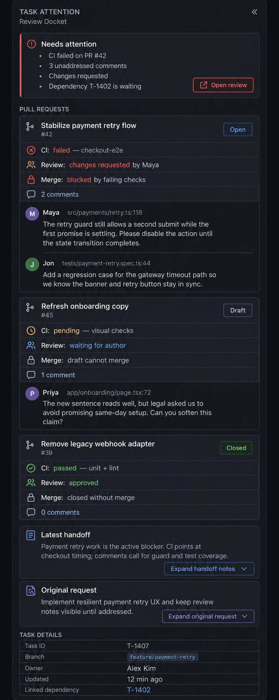

# Task Attention Pane design brief

Design task: KVG-1416
Implementation task: KVG-1425

## Outcome

Use the **Calm Command Pane** direction for the task detail right-hand pane. The default right pane should become a **Task Attention Pane**: a calm, status-first surface that shows what needs attention before long-form task documents.

## Selected design

## Comparison designs

### Signal Stack

Compact utilitarian stack optimized for strict scan order and easiest implementation.

### Review Docket

Decision-oriented pane that frames Pull Requests and comments as review evidence.

### Calm Command Pane

Selected direction. Polished command-center treatment with neutral cards, semantic chips, and subtle blocker accents.

## Confirmed product decisions

- Replace the default task detail right-hand pane with the **Task Attention Pane** rather than adding a separate tab or mode.
- Optimize the pane as a status-first surface, not a document reader.
- Priority order:
  1. Attention summary / next action.
  2. Pull Request, review, CI, merge, and comment signals.
  3. Handoff Notes preview.
  4. Initial Prompt collapsed or tightly previewed.
  5. Secondary metadata such as dependencies, dependents, labels, and workspace.
- Multiple Pull Requests are first-class and should be represented equally; do not select one primary or driving PR.
- Pull Requests should render as a vertical compact card stack.
- Unaddressed Pull Request comments should render as full text inline under the relevant Pull Request card.
- Visual treatment should stay calm by default: neutral cards and semantic chips, with severe blockers using subtle semantic accent borders rather than loud alert panels.
- Handoff Notes should use a short preview by default with explicit expand behavior.
- Initial Prompt should be collapsed or limited to two or three lines by default with explicit expand behavior.

## Recommended implementation shape

- Start in `src/components/task-detail/TaskInfoPanel.svelte` and split the right pane into focused subcomponents instead of growing the existing panel.
- Keep existing typed data flows: task data from props/stores, Pull Request data from `ticketPrs`, comments through existing IPC wrappers, and external links through `openUrl()`.
- Reuse existing presentation helpers where possible:
  - `getPrStatusChips()`
  - `PrStatusChip`
  - `parseCheckRuns()` / `splitCheckRuns()`
  - `TaskRelationshipDetailSection`
  - `MarkdownContent`
- Avoid hardcoded hex colors. Use daisyUI semantic classes and Tailwind utilities.
- Preserve Svelte 5 runes patterns and project conventions.

## Test expectations for implementation task

Add focused tests for business/product behavior rather than visual styling:

- The Task Attention Pane renders attention/PR/comment signals before Handoff Notes and Initial Prompt.
- Multiple Pull Requests render with equal structure/weight in source order or the existing task PR order; no primary PR is selected.
- Unaddressed comments render full text inline under the related Pull Request.
- Handoff Notes are previewed by default and can be expanded.
- Initial Prompt is collapsed or tightly previewed by default and can be expanded.
- Empty states remain calm when no Pull Requests or no comments exist.

## Accessibility notes

- Use semantic sections and headings in logical order.
- Expand controls should be real buttons with accessible names and `aria-expanded`/`aria-controls` where practical.
- Do not communicate status by color alone; chips should include text labels.
- Keep visible focus rings for keyboard users.
- Maintain readable contrast in light and dark themes.
