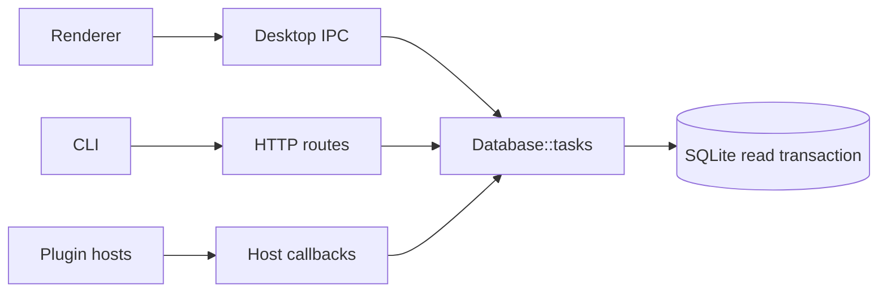
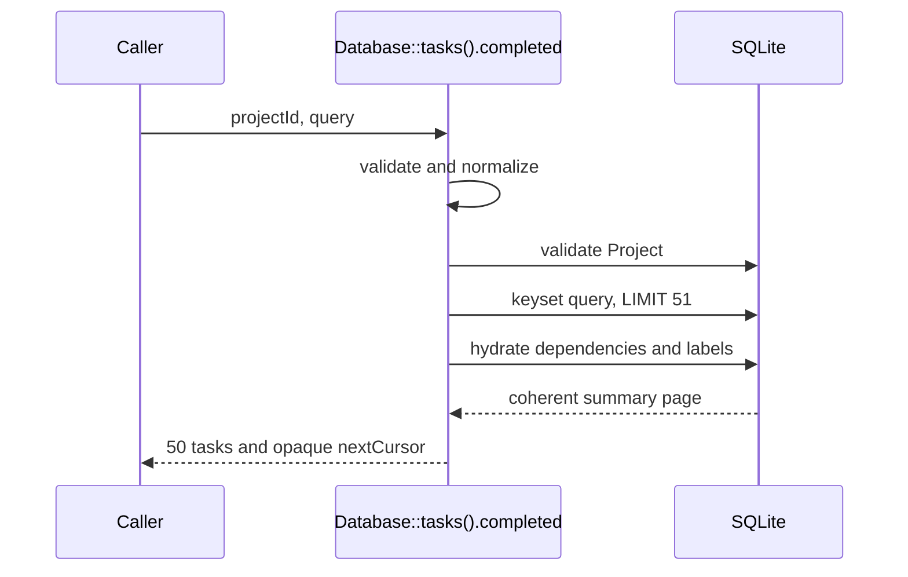
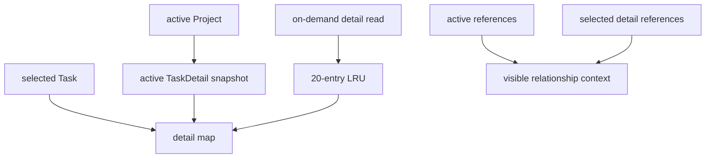

# Task API boundary architecture handoff

`scale-task-api-boundaries` now exposes three canonical, project-scoped Task reads. Active Tasks remain selection-ready in renderer memory; Completed Task history is fixed-size and never loads full prompts until a detail read is requested.

## Canonical contract

| Read | Result | Intended use |
| --- | --- | --- |
| `tasks.active(projectId)` | `{ tasks: TaskDetail[], related: TaskReference[] }` | Bounded active board state and synchronous selection |
| `tasks.completed(projectId, query?)` | `{ tasks: TaskSummary[], nextCursor: string \| null }` | Fixed pages of Completed Tasks |
| `tasks.detail(projectId, taskId)` | `{ task: TaskDetail, related: TaskReference[] } \| null` | Explicit full-detail navigation |

The only canonical projections are `TaskReference`, `TaskSummary`, and `TaskDetail`. Their external fields are camelCase. `TaskDetail.prompt` is the authoring prompt; the legacy execution-override prompt is not exposed by canonical reads.

`src-tauri/src/db/task_reads.rs` is the deep Rust module. It owns project validation, query validation, scope-bound cursors, projection assembly, relationship context, and coherent read transactions. Transport adapters translate requests, results, and typed errors; they do not own read policy.

## Persistence bounds

- A Project may have at most 500 non-Completed Tasks.
- A Task may have at most 100 direct relationships in both directions combined.
- Duplicate dependency edges are idempotent.
- Limit checks and writes occur in the same transaction, including restoration and Completed-to-active transitions.
- `prompt_preview` is persisted and maintained on authoring-prompt writes.
- Prompt-derived previews and fallback titles remove image reference definitions and stop at 120 Unicode characters.
- Explicit Task Display Titles remain lossless.

Active and detail reads hydrate Task rows, labels, dependencies, and immediate relationship references inside one SQLite transaction.

## Completed Task reads

Completed pages always contain at most 50 `TaskSummary` records ordered by `updatedAt DESC, id DESC`. Callers cannot supply status or page-size controls.

Supported filters are:

- `search`: at most 200 Unicode characters
- `labels`: at most 20 normalized names
- each label: at most 40 Unicode characters
- `cursor`: opaque keyset cursor

A cursor binds its format version, Project, normalized search, normalized labels, `updatedAt`, and Task ID. Reusing it under another scope returns an invalid-query outcome.

The shared observable fixture is `docs/contracts/task-read-contract-fixtures.json`. Rust production behavior and the plugin SDK in-memory adapter both consume it.

## Renderer state ownership

`src/lib/tasksState.ts` owns:

- the visible Project's active details
- active relationship references
- project-keyed active snapshots
- on-demand detail contexts
- request generations and stale-result rejection
- deleted-Project pruning
- deletion eviction
- the 20-entry on-demand full-detail LRU

Focus selection is synchronous after active data loads. Selecting a Completed or cross-project Task performs one `detail` read. Cache hits promote the entry. Active details are not counted against the on-demand LRU.

The state module validates returned Task and Project identities before caching. Private generations prevent old active or detail responses from replacing newer state. Same-Project refresh keeps existing state visible until replacement succeeds; an uncached Project switch detaches the previous Project immediately.

## Transport map

### Desktop IPC

- `tasks_active`
- `tasks_completed`
- `tasks_detail`

The generated desktop registry is checked in and validated by `pnpm electron:contract:check`.

### HTTP

- `GET /v2/projects/:project_id/tasks/active`
- `GET /v2/projects/:project_id/tasks/completed`
- `GET /v2/projects/:project_id/tasks/:task_id`

Invalid filters and cursors map to 400. Missing Projects and details map to 404. Write-limit conflicts map to 409.

### CLI

- `openforge task active --project-id <id>`
- `openforge task completed --project-id <id> [--search ...] [--label ...] [--cursor ...]`
- `openforge task detail --project-id <id> --task-id <id>`

`task history list` was removed. Version 1 `task list` and `task get` remain deprecated compatibility commands.

### Plugin SDK and hosts

Frontend and backend hosts expose equivalent `active`, `completed`, and `detail` requests and results. The checked-in backend runtime is rebuilt with `pnpm build:plugin-sdk-runtime`.

Published version 1 `tasks.list()` and `tasks.get()` remain translation-only adapters. They preserve unscoped listing, `includeDone`, complete-array, legacy prompt, projection, and missing-Task behavior. A plugin activation emits at most one deprecation warning. These methods are marked for removal in version 2. First-party and bundled-plugin code uses only canonical reads.

## Compatibility isolation

Legacy `Task` conversion is confined to outer version 1 seams such as `src/lib/plugin/pluginHostTasks.ts`. Canonical application code carries `TaskDetail`, including create and compose flows. Rejected snapshot, history, caller-revision, and renderer context APIs were deleted rather than retained beside the canonical interface.

Repository searches for the rejected API names are empty outside historical OpenSpec material.

## Production-scale evidence

`canonical_reads_stay_bounded_with_production_scale_completed_prompts` creates 2,000 Completed Tasks, 70 active Tasks, and 2,048 prompt bytes per Task. The recorded focused run produced:

| Measure | Result |
| --- | ---: |
| Total Completed prompt bytes | 4,096,000 |
| Completed rows returned | 50 |
| Completed page bytes | 15,819 |
| Completed query time | 2,348 µs |
| Active Tasks returned | 70 |
| Active payload bytes | 175,284 |
| Completed read SQL statements | 4 fixed statements |

The Completed path executes Project validation, one keyset summary query, one dependency hydration query, and one label hydration query. Its statement count and payload do not grow with total Completed Task prompt bytes.

Focused renderer tests cover synchronous Focus selection and true LRU promotion/eviction. Focused Rust tests cover exactly 100 direct relationships, rejection of the 101st edge, duplicate idempotency, concurrent writes, and rollback.

## Main implementation files

- `src-tauri/src/db/task_reads.rs`
- `src-tauri/src/db/task_reads_tests.rs`
- `src-tauri/src/db/task_creation.rs`
- `src-tauri/src/db/task_dependencies.rs`
- `src-tauri/src/http_server/legacy_transport/task_read_routes.rs`
- `src-tauri/src/app_invoke/core_unmatched/tasks.rs`
- `src-tauri/src/plugin_host/task_callbacks.rs`
- `src/lib/tasksState.ts`
- `src/lib/ipc/tasks.ts`
- `src/lib/plugin/pluginHostTasks.ts`
- `packages/plugin-sdk/src/testing/commonApiFake.ts`
- `docs/contracts/task-read-contract-fixtures.json`

## Verification snapshot

Final affected-system validation:

- `pnpm test`: 615 files passed, 1 skipped; 4,969 tests passed, 10 skipped
- `pnpm exec tsc --noEmit`
- `pnpm lint`
- `pnpm electron:contract:check`
- `pnpm build:plugin-sdk-runtime`, with the checked-in runtime byte-identical
- `pnpm packages:contract:check`
- `pnpm build:plugins`
- Rust unit tests: 1,860 passed, 1 ignored, plus 3 and 1 integration tests
- `cargo check`
- `cargo build`
- `cargo clippy -- -D warnings`
- `git diff --check HEAD`
- `openspec validate scale-task-api-boundaries --strict`
