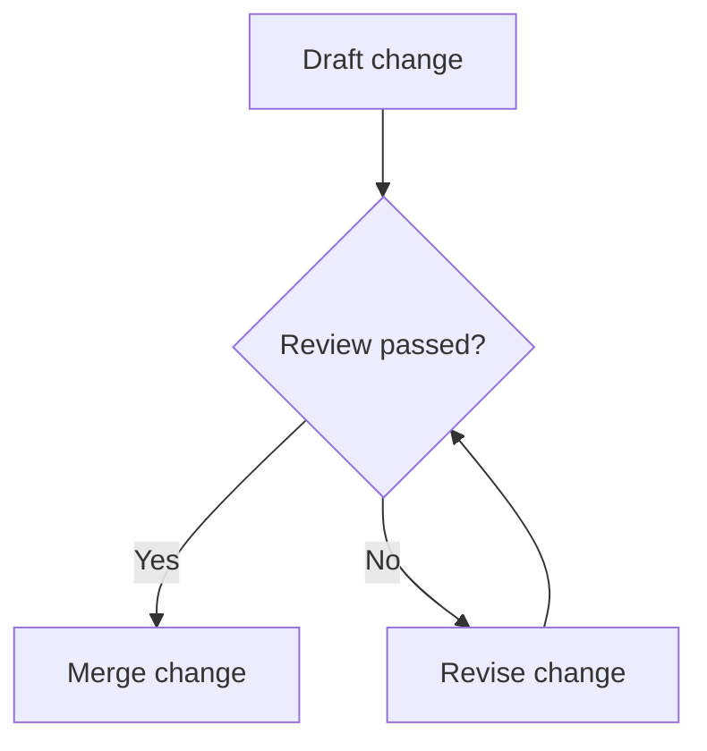
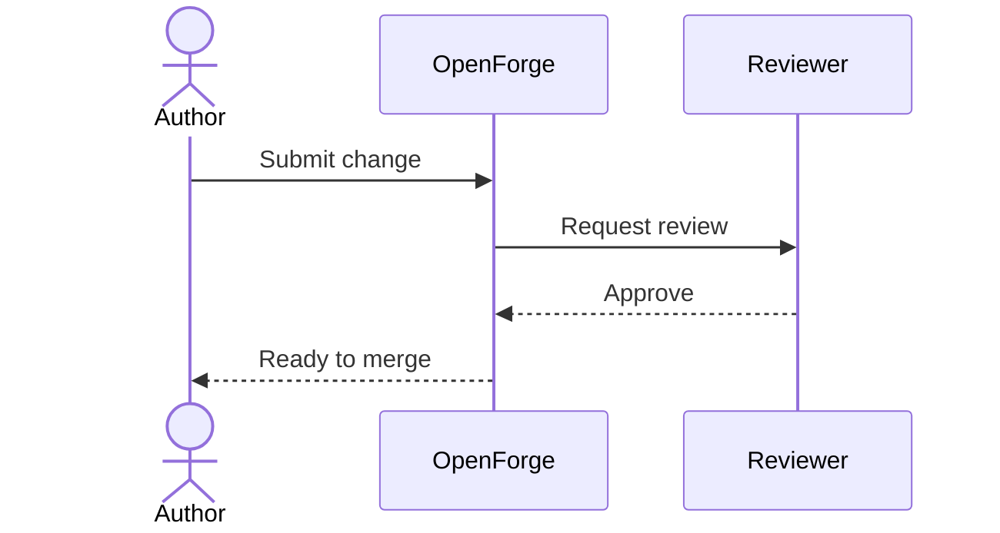
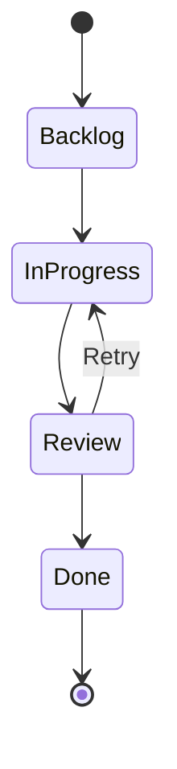
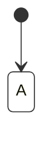

# System diagrams

Mermaid fences render as diagrams while ordinary code fences remain source code.

## Delivery flow



## Review sequence



## Task lifecycle



## Unsafe resource fallback



## Invalid diagram fallback

```mermaid
this is not valid Mermaid syntax
```
